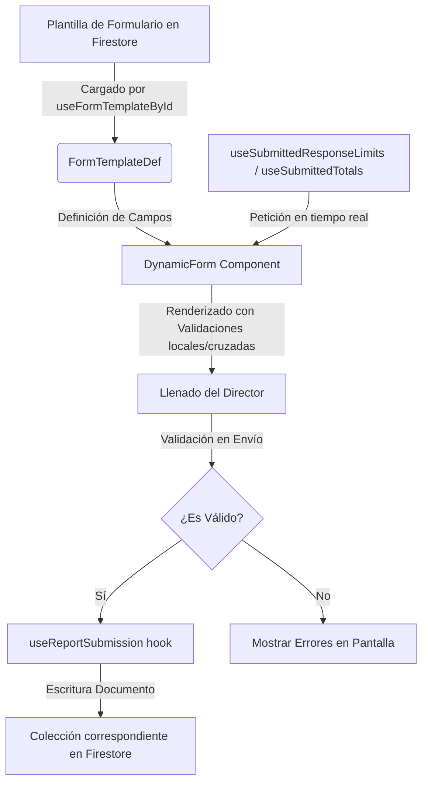

# Estructura y Arquitectura del Proyecto

El proyecto está diseñado bajo un enfoque de **Desarrollo Guiado por Características (Feature-Driven Development)**. Toda la lógica de negocio se encapsula por dominios lógicos (features) antes de generalizarse, lo que permite que el proyecto sea altamente mantenible y escalable.

---

## 🛠️ Stack Tecnológico Principal

*   **Frontend Framework**: [React 19](https://react.dev/) + [TanStack Start](https://tanstack.com/start) (Full-stack React con renderizado híbrido y funciones del lado del servidor / SSR).
*   **Enrutado**: [TanStack Router](https://tanstack.com/router) (Enrutado basado en archivos con tipado estricto completo de rutas y parámetros).
*   **Manejo de Estado**: [TanStack Query](https://tanstack.com/query) (React Query) para sincronización del estado del servidor y caché inteligente.
*   **Base de Datos y Autenticación**: [Firebase Firestore](https://firebase.google.com/docs/firestore) y [Firebase Authentication](https://firebase.google.com/docs/auth).
*   **Estilos**: [Tailwind CSS v4](https://tailwindcss.com/) con tokens avanzados y soporte nativo para temas claro/oscuro (Dark Mode).
*   **Componentes UI**: Componentes adaptados y extendidos a partir de [Shadcn UI](https://ui.shadcn.com/) (como `Sheet`, `Select`, `Button`, `DataTable` con TanStack Table).
*   **Calidad de Código**: [Biome](https://biomejs.dev/) para linting y formateo ultrarrápido, y [Vitest](https://vitest.dev/) para testing unitario.

---

## 📁 Estructura de Directorios

La estructura base de directorios dentro de `src/` está dividida en cuatro pilares:

```txt
src/
  ├── app/        # Layout global, Sidebar, ThemeToggle, Providers (Auth, Query)
  ├── routes/     # Archivos de rutas físicas del TanStack Router (sin lógica de negocio)
  ├── features/   # Lógica agrupada por módulos o dominios lógicos
  └── shared/     # Componentes UI reutilizables (Shadcn), tipos globales y configuración de infraestructura
```

### 🧱 Reglas del Diseño de Directorios

1.  **Enrutado puro**: Los archivos en `src/routes/` solo deben definir las rutas físicas, manejar los parámetros y conectar/renderizar componentes provenientes de `src/features/`. **No debe haber lógica de negocio, hooks pesados o consultas de datos complejas en esta carpeta.**
2.  **Modularidad de Features**: Si una utilidad, hook o tipo de dato es usado por un único dominio (ej. solo por el inicio de sesión), este debe residir dentro de `src/features/auth/` y no en `src/shared/`.
3.  **Generalización Controlada**: Solo se mueven archivos a `src/shared/` si dos o más características independientes los requieren para evitar duplicidad de código.
4.  **Prohibidas las carpetas genéricas en la raíz**: Estructuras del estilo `src/components/`, `src/hooks/` o `src/pages/` están prohibidas para mantener el orden modular.

---

## 🏷️ Módulos de Características (`src/features/`)

El core funcional de la aplicación se distribuye en las siguientes características:

*   **`auth/`**: Controla el inicio de sesión tanto de Directores por CI como de Administradores por Email/Password. Contiene el `AuthProvider`, el hook de control de rutas protegidas (`useProtectedRoute`) y componentes relacionados.
*   **`dashboard/`**: Contiene los paneles visuales globales, la lista de reportes para directores y las pantallas de gestión de CRUD de datos de referencia (como programas, facultades y modalidades) para los administradores.
*   **`dynamic-form/`**: El motor dinámico de renderizado de formularios. Lee la definición de campos (`FormTemplateDef`) y dibuja inputs, selects, validaciones y subidas según la metadata.
*   **`reference-data/`**: Hooks dedicados a interactuar con los catálogos y datos paramétricos de la universidad cargados en Firestore.
*   **`reports/`**: Lógica de llenado y visualización de reportes por área específica. Aquí residen componentes como `student.tsx`, `scholarship.tsx`, `teacher.tsx` y `graduates.tsx` que manejan los reportes del Director.

---

## 🚦 Flujo de Datos y Renderizado Dinámico

La generación de un formulario y la recolección de respuestas sigue el siguiente flujo de datos:


